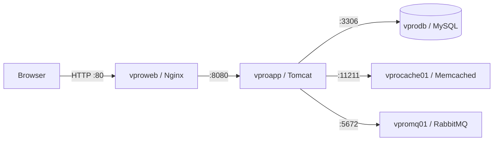

# Dockerized VProfile Application

A multi-container Java web application demonstrating Docker-based deployment of VProfile with Nginx, Tomcat, MySQL, Memcached, and RabbitMQ. The repository also includes a Jenkins pipeline for Maven validation and Nexus artifact publication, Ansible deployment playbooks, and optional Vagrant environments.

## Overview

The checked-in application uses Spring MVC, Spring Security, Spring Data JPA, and JSP views. Its source includes account registration, login, profile management, cached user lookups, and integrations for messaging, file uploads, and Elasticsearch.

**Current setup notes:** Before running the root Compose stack, fix the Memcached configuration key and Nginx filename described below. The application Dockerfile currently builds the `containers` branch of [hkhcoder/vprofile-project](https://github.com/hkhcoder/vprofile-project), rather than the Java source in this repository. Elasticsearch is referenced by the application but is not included in Compose.

## Architecture



Compose creates a default network where services resolve each other by service name.

| Service | Role | Image or build | Published host port |
| --- | --- | --- | --- |
| `vproweb` | Reverse proxy | `Docker-files/web`, based on `nginx` | `80` |
| `vproapp` | Java application server | `Docker-files/app`, Tomcat 10 / JDK 21 | `8080` |
| `vprodb` | Relational database | `Docker-files/db`, MySQL 8.0.33 | `3306` |
| `vprocache01` | Application cache | `memcached` | `11211`, after correcting `ports` |
| `vpromq01` | Message broker | `rabbitmq` | `5672` |

The application image uses Maven 3.9.9 and JDK 21 in its build stage. The local `pom.xml` targets Java 17 and packages the application as a WAR.

## Prerequisites

- Git.
- Docker Engine or Docker Desktop with Docker Compose v2.
- A running Docker daemon using Linux containers.
- Internet access to download images, Maven dependencies, and the upstream application source.
- Available host ports listed above.

Java and Maven do not need to be installed on the host for the existing Docker build. Building the checked-in Java source separately requires JDK 17 or a compatible newer JDK and Maven 3.

## Getting started

### 1. Clone the repository

```bash
git clone https://github.com/kenechukwu007/dockerized-app.git
cd dockerized-app
```

### 2. Correct the two configuration errors

In [compose.yaml](./compose.yaml), change `port:` to `ports:` under `vprocache01`:

```yaml
    vprocache01:
      image: memcached
      container_name: vprocache01
      ports:
        - "11211:11211"
```

The [web Dockerfile](./Docker-files/web/Dockerfile) expects `nginxvproapp.conf`, but the file is committed as `nginvproapp.conf`. Rename it:

**Linux/macOS**

```bash
mv Docker-files/web/nginvproapp.conf Docker-files/web/nginxvproapp.conf
```

**Windows PowerShell**

```powershell
Rename-Item Docker-files/web/nginvproapp.conf nginxvproapp.conf
```

Alternatively, change the Dockerfile's `COPY` source to the existing filename.

### 3. Validate and build

```bash
docker compose config --quiet
docker compose build
```

The application build clones an external repository and runs `mvn install`. Changes to this repository's `src/` or `pom.xml` will not be included in that image unless its build strategy is changed.

### 4. Start the services

Start the backing services first:

```bash
docker compose up -d vprodb vprocache01 vpromq01
docker compose logs -f vprodb
```

Wait for MySQL initialization to finish and for the server to report that it is ready for connections. Press Ctrl+C to stop following logs, then start the application and proxy:

```bash
docker compose up -d vproapp vproweb
docker compose ps
docker compose logs -f vproapp vproweb
```

The supplied Compose file has no health checks or dependency-readiness conditions. Container startup alone does not confirm application readiness.

### 5. Open the application

- Through Nginx: [http://localhost](http://localhost)
- Directly through Tomcat: [http://localhost:8080](http://localhost:8080)

The WAR is deployed as `ROOT.war`, so no `/vprofile` context path is required. If using a remote Docker host or a Vagrant guest, replace `localhost` with that host's reachable address.

Use the registration flow where available. Do not assume that credentials listed in local properties are valid for the upstream application built by the Dockerfile.

## Application configuration

The checked-in source reads settings from [application.properties](./src/main/resources/application.properties).

| Setting | Checked-in target |
| --- | --- |
| JDBC URL | `jdbc:mysql://vprodb:3306/accounts?useUnicode=true&characterEncoding=UTF-8&zeroDateTimeBehavior=convertToNull` |
| Database username | `root` |
| Active Memcached server | `vprocache01:11211` |
| Standby Memcached server | `127.0.0.2:11211` |
| RabbitMQ server | `vpromq01:5672` |
| Elasticsearch | `localhost:9300` |

The standby cache and Elasticsearch settings do not correspond to services supplied by Compose. Inside a container, loopback addresses refer to that container.

Database and RabbitMQ credentials are currently hardcoded in the configuration. Coordinate any credential changes across the services and the application actually being built. The Compose file does not provide an environment-variable contract for overriding the Java application's properties; creating a `.env` file alone will not replace those values.

## Database and persistence

The database image initializes the `accounts` database using [Docker-files/db/db_backup.sql](./Docker-files/db/db_backup.sql). MySQL initialization scripts run only when its data directory is empty.

| Named volume | Mount point | Purpose |
| --- | --- | --- |
| `vprodb_data` | `/var/lib/mysql` | Persistent database files |
| `vproapp_data` | `/var/local/tomcat/webapps` | Declared application volume |

**Application volume caveat:** Tomcat in the Dockerfile deploys to `/usr/local/tomcat/webapps`. The declared application volume uses `/var/local/tomcat/webapps`, so it does not persist that deployment directory.

Stop and remove containers while retaining named volumes:

```bash
docker compose down
```

To deliberately delete the stack's named volumes and reinitialize the database on the next startup:

```bash
docker compose down --volumes
```

This deletes stored database data. Back up anything you need before running it.

## Common operations

Run these commands from the repository root:

```bash
# Show container status
docker compose ps

# Follow all service logs
docker compose logs -f

# Restart the application
docker compose restart vproapp

# Rebuild and recreate application/proxy containers
docker compose up -d --build vproapp vproweb

# Stop the stack
docker compose down
```

The upstream application branch is not pinned to a commit. Docker may also reuse the layer that cloned it. For a reproducible application build, pin the source revision or change the Dockerfile to build this repository's checkout.

## Build and test the checked-in Java source

These commands operate on the local source, independently of the current application Dockerfile:

```bash
mvn clean package
mvn test
mvn verify
mvn checkstyle:checkstyle
```

The configured Maven coordinates produce `target/vprofile-v2.war`. Test sources are under `src/test/java`.

The POM does not configure a separate Maven Failsafe integration-test suite. Do not interpret the Jenkins stage named “INTEGRATION TEST” as proof of dedicated integration-test coverage. The JaCoCo plugin configuration is commented out.

## Jenkins pipeline

The [Jenkinsfile](./Jenkinsfile) defines:

1. Maven build with tests skipped during that stage, followed by WAR archival.
2. Unit tests using `mvn test`.
3. A verification stage using `mvn verify -DskipUnitTests`.
4. Checkstyle report generation.
5. SonarQube analysis and a quality-gate wait.
6. WAR and POM publication to Nexus using the Jenkins build ID as the publication version.

Before using it, configure Maven and a compatible JDK on the Jenkins agent, the `sonarscanner4` tool, the `sonar-pro` SonarQube installation, and the `nexuslogin` credential. Update the Nexus address and repository settings for your environment. Jenkins also needs the plugins supporting SonarQube, Pipeline Utility Steps, and Nexus Artifact Uploader.

This pipeline publishes Maven artifacts to Nexus. It does not build/push Docker images or deploy the Compose stack.

## Optional infrastructure files

- **Ansible:** `ansible/site.yml` imports Tomcat setup and application deployment playbooks. These require your own inventory, variables, Nexus access, and credentials. The deployment playbook targets Tomcat 8, whereas the Docker runtime uses Tomcat 10; review compatibility before reusing it for the current application.
- **Vagrant:** Separate configurations exist for Windows/Intel macOS with VirtualBox and ARM macOS with VMware Desktop. The supplied Vagrantfiles define virtual machines but do not install Docker automatically. The Windows/Intel directory also contains a separate copy of the Docker setup; the instructions above refer to the repository-root setup.

## Troubleshooting

| Problem | Check or correction |
| --- | --- |
| Compose rejects `port` | Rename it to `ports` under `vprocache01`. |
| Web image build cannot find `nginxvproapp.conf` | Correct the filename mismatch described in Getting started. |
| Browser returns 502 | Inspect `docker compose logs vproweb vproapp`; confirm Tomcat started and deployed the WAR. |
| Application cannot reach MySQL | Check database initialization, service hostname, and credentials. Restart the application after dependencies are ready if needed. |
| Database changes do not appear | Initialization SQL is not rerun on an existing database volume. Apply a migration/import or intentionally reset disposable data. |
| Local code edits do not appear in Docker | The app Dockerfile builds the external upstream repository, not local source. |
| Messaging authentication fails | Check broker logs and credentials. RabbitMQ's guest-user access policy can affect connections from another container. |
| Elasticsearch features fail | Compose does not include Elasticsearch; the local properties point to loopback. |
| Port already in use | Stop the conflicting service or change the host side of the relevant port mapping. |

## Repository structure

```text
dockerized-app/
├── Docker-files/
│   ├── app/Dockerfile
│   ├── db/
│   │   ├── Dockerfile
│   │   └── db_backup.sql
│   └── web/
│       ├── Dockerfile
│       └── nginvproapp.conf
├── ansible/
├── src/
│   ├── main/
│   │   ├── java/
│   │   ├── resources/
│   │   └── webapp/
│   └── test/java/
├── vagrant/
├── compose.yaml
├── Jenkinsfile
├── pom.xml
└── README.md
```

The tree shows the Nginx filename as currently committed, before the setup correction.

## Deployment considerations

Treat the supplied configuration as a development/lab setup. It publishes database, cache, and broker ports, uses hardcoded credentials, and does not configure HTTPS. Before exposing it beyond a controlled environment, restrict network access, replace shared credentials, use a dedicated database account, and review dependency and image versions.

No project-level license file is present in this repository. Review permissions and upstream licensing before redistribution.


